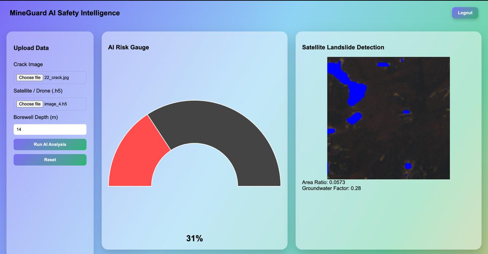
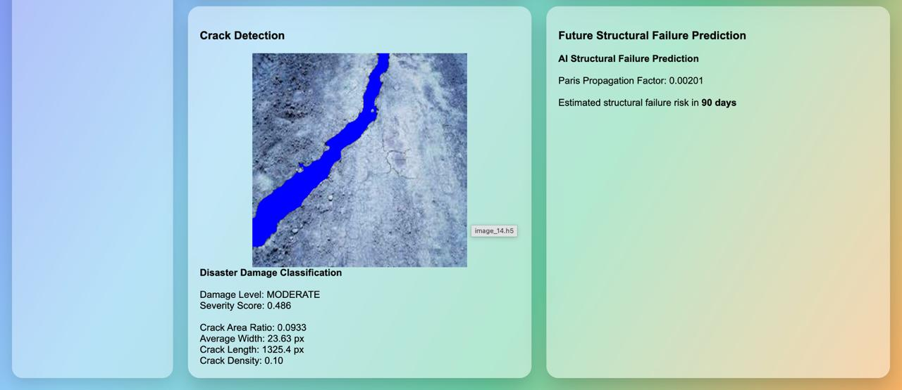

# MineGuard AI
## Intelligent Disaster Damage Classification & Predictive Risk Monitoring System

MineGuard AI is an advanced AI-based disaster monitoring platform that analyzes structural damage and terrain instability using **computer vision, satellite imagery, and engineering fracture models**.

The system automatically detects cracks, landslides, and terrain instability, classifies damage severity, and predicts future structural failures before catastrophic disasters occur.

MineGuard AI transforms raw visual data into **actionable disaster intelligence for early risk mitigation.**

---

# Problem Statement

Disasters such as **landslides, infrastructure failures, slope collapses, and structural cracks** cause significant damage globally.

Monitoring these risks is challenging because:

- Manual inspection is slow and inconsistent
- Large geographic regions cannot be monitored continuously
- Early warning signs such as cracks or terrain deformation are often ignored
- Environmental factors like groundwater pressure influence disasters
- Existing systems detect damage but **cannot predict future failures**

There is a critical need for **an automated AI-driven disaster monitoring system that not only detects damage but predicts structural failure risk.**

---

# Our Solution

MineGuard AI provides an **intelligent disaster monitoring platform** that combines:

• AI-based image segmentation  
• Satellite terrain monitoring  
• Structural damage feature extraction  
• Physics-based fracture mechanics modeling  

The platform analyzes images from **cameras, drones, or satellites** to detect disaster risks and predict potential failures.

MineGuard AI transforms raw image data into **real-time disaster risk intelligence.**

---

# System Workflow

Image Input (Drone / Camera / Satellite)
↓
AI Segmentation Model
↓
Damage Feature Extraction
(area, width, length, density)
↓
Disaster Damage Classification
↓
Physics-Based Crack Propagation Model
(Paris Law)
↓
Future Structural Failure Prediction
↓
AI Risk Monitoring Dashboard

---

# Key Features

## 1. AI Disaster Damage Classification

MineGuard AI classifies structural damage severity automatically.

Damage categories include:

LOW
MODERATE
HIGH
SEVERE

This converts raw visual information into **structured disaster risk levels**.

---

## 2. Crack Detection & Structural Health Monitoring

The AI model performs semantic segmentation to detect cracks and calculate critical engineering metrics:

• Crack Area Ratio  
• Crack Width  
• Crack Length  
• Crack Density  

These metrics are used to estimate **structural health and stability.**

---

## 3. Landslide Detection from Satellite Imagery

MineGuard AI analyzes satellite terrain data to detect landslide-prone regions.

The system calculates:

• Landslide area ratio  
• Terrain deformation zones  
• Instability regions  

This enables **large-scale disaster monitoring across wide geographic areas.**

---

## 4. Physics-Based Crack Growth Modeling

To predict structural failure, the system integrates **Paris Law fracture mechanics modeling**.

Paris Law:

da/dN = C(ΔK)^m

This allows the system to estimate:

• Crack propagation rate  
• Structural degradation trends  
• Estimated failure timelines

Unlike traditional AI systems that only detect damage, MineGuard AI **predicts future structural risks.**

---

## 5. Environmental Risk Integration

MineGuard AI integrates environmental factors that influence disaster probability.

These include:

• Groundwater pressure (borewell depth)  
• Terrain slope instability  
• Structural stress distribution  

Combining environmental data with visual AI analysis significantly improves **risk prediction accuracy.**

---

## 6. AI Risk Monitoring Dashboard

The system includes an interactive dashboard that visualizes:

• Crack segmentation overlays  
• Landslide detection maps  
• Disaster severity classification  
• AI risk gauge indicators  
• Structural failure prediction timeline  

This enables **real-time monitoring and decision-making.**

---

# Innovation & Uniqueness

MineGuard AI introduces several novel concepts that distinguish it from traditional monitoring systems.

---

## Hybrid AI + Engineering Physics Model

Most disaster detection systems rely only on AI image recognition.

MineGuard AI combines:

• Deep learning image analysis  
• Structural fracture mechanics (Paris Law)

This hybrid approach enables **predictive structural intelligence rather than simple detection.**

---

## Multi-Modal Disaster Data Fusion

The system integrates multiple data sources:

• Structural crack images  
• Satellite terrain imagery  
• Groundwater environmental data  

This multi-modal fusion improves disaster prediction accuracy.

---

## Predictive Disaster Intelligence

Instead of reacting after damage occurs, MineGuard AI predicts **future structural failure risks**, enabling early intervention.

---

## Scalable Monitoring Architecture

The system can scale to multiple monitoring environments:

• Mines and slopes  
• Bridges and infrastructure  
• Mountain landslide zones  
• Urban disaster monitoring

---

## Automated Disaster Risk Quantification

MineGuard AI converts raw images into measurable engineering parameters.

This allows disaster risks to be quantified through:

• Structural damage metrics  
• Environmental stress indicators  
• AI risk scoring models

---

# Applications

MineGuard AI can be deployed in several domains:

• Landslide monitoring systems  
• Structural health monitoring  
• Mining slope safety analysis  
• Infrastructure inspection  
• Disaster management authorities  
• Smart city safety monitoring

---

# Technology Stack

Computer Vision  
OpenCV

AI Model Inference  
ONNX Runtime

Backend  
FastAPI

Frontend  
HTML / CSS / JavaScript

Visualization  
Chart.js

Data Processing  
NumPy  
HDF5

Deployment  
Desktop AI Monitoring Software

---

# Installation

Clone repository:

git clone https://github.com/yourusername/mineguard-ai.git
cd mineguard-ai

Install dependencies:

pip install numpy opencv-python pillow onnxruntime h5py fastapi uvicorn python-multipart

Run backend server:

python backend/backend_entry.py

Open the dashboard:

dashboard.html

---

# Future Enhancements

Future versions of MineGuard AI may include:

• Real-time drone monitoring  
• AI-based collapse probability heatmaps  
• Time-series crack growth prediction  
• Satellite API integration  
• Automated emergency alert systems  
• Cloud-based disaster monitoring platform

---

# Dashboard Output

## Main Monitoring Dashboard

The dashboard provides:

- AI Risk Gauge  
- Satellite Landslide Detection  
- Crack Detection  
- Structural Failure Prediction  
- Borewell groundwater factor  

This allows engineers and disaster monitoring teams to **visualize structural risk in real time**.

---

# Crack Detection Output

The crack analysis module extracts important structural parameters.

# Impact

MineGuard AI enables proactive disaster prevention through intelligent monitoring.

Benefits include:

• Early disaster detection  
• Reduced infrastructure failure risk  
• Improved public safety  
• Enhanced disaster management capabilities

By predicting structural risks before failure occurs, MineGuard AI helps protect **both human lives and critical infrastructure.**

